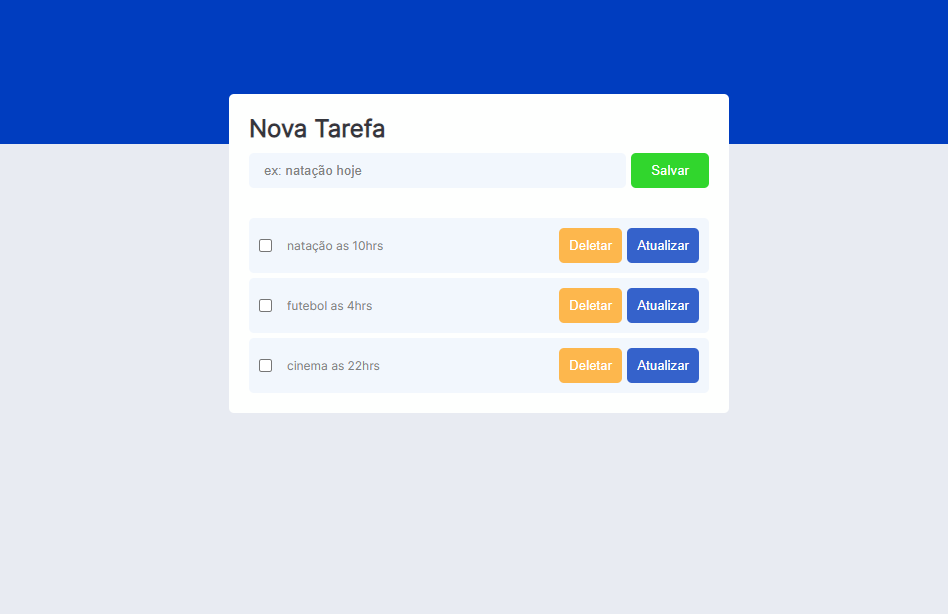

<h1 align="center">
    
</h1>

## 🧪 Tecnologias

Esse projeto foi desenvolvido com as seguintes tecnologias:

- [React](https://reactjs.org)
- [Javascript](https://www.javascript.com/)
- [Uuid](https://github.com/uuidjs/uuid)
- [Prop-types](https://github.com/facebook/prop-types)
- [LocalStorage](https://developer.mozilla.org/pt-BR/docs/Web/API/Window/localStorage)

## 🚀 Como executar

Clone o projeto e acesse a pasta do mesmo.

```bash
$ git clone https://github.com/carloseduardoalvesviana/todo-list-app.git
$ cd todo-list-app
```

Para iniciá-lo, siga os passos abaixo:
```bash
# Instalar as dependências
$ yarn

# Iniciar o projeto
$ yarn start
```
O app estará disponível no seu browser pelo endereço http://localhost:3000.

## 💻 Projeto

Todo App é perfeito para organizar as tarefas basicas do dia a dia.

---

Feito com 💜 by carlos viana

👋🏻 [linkedin] (https://www.linkedin.com/in/carlos-eduardo-alves-viana/)